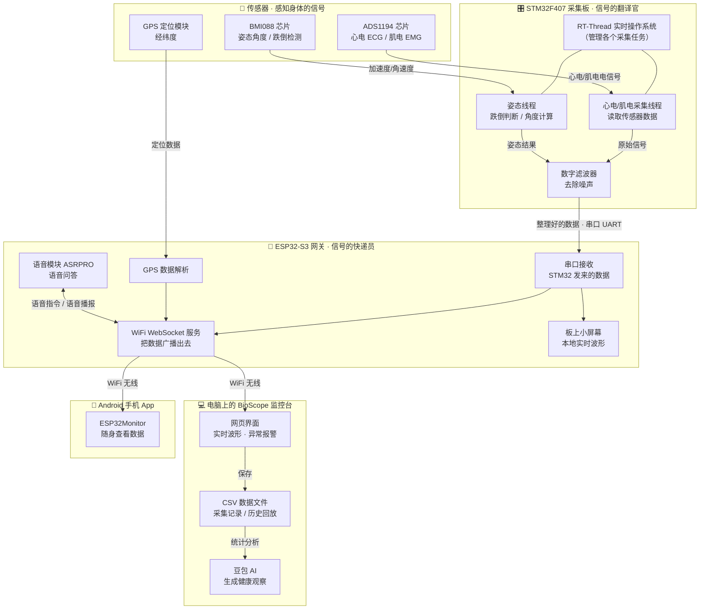
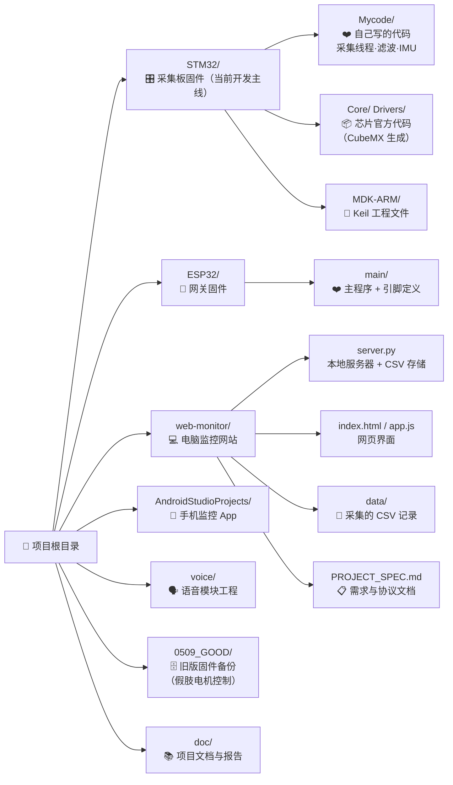

# 项目架构图

> 本文档用 Mermaid 图表展示整个项目的模块结构，面向非技术人员，只需看图即可理解各模块如何协作。

---

## 一、系统运行架构（数据是怎么流动的）

> 一句话理解：**传感器感知身体 → STM32 采集翻译 → ESP32 无线转发 → 电脑/手机查看**。

### 图例

| 图形 | 含义 |
| --- | --- |
| 🧬 传感器 | 贴在身上的设备，负责感知信号 |
| 🎛️ 采集板 | 把传感器信号翻译成数据（本项目核心） |
| 📶 网关 | 负责把数据无线发送出去 |
| 💻 / 📱 | 查看数据的终端 |
| 实线箭头 | 数据从一个模块流向另一个模块 |

---

## 二、仓库目录地图（代码放在哪里）

---

## 三、每个模块一句话说明

| 模块 | 扮演的角色 | 一句话说明 |
| --- | --- | --- |
| `STM32/` | 信号的翻译官 | F407 采集板，用 RT-Thread 系统实时读取心电、肌电、姿态传感器数据，滤波后发给 ESP32 |
| `ESP32/` | 信号的快递员 | S3 网关，接收 STM32 数据，通过 WiFi 无线发给电脑和手机；同时驱动小屏幕、GPS 和语音模块 |
| `web-monitor/` | 电脑监控台 | 本地网站，实时显示波形、触发报警、把数据存成 CSV、回放历史、生成 AI 健康观察 |
| `AndroidStudioProjects/` | 随身监视器 | 手机 App，连上 ESP32 也能看数据 |
| `voice/` | 语音助手 | ASRPRO 语音模块固件，支持语音问答 |
| `0509_GOOD/` | 旧版存档 | 早期"正常步态"固件备份（含假肢电机 CAN 控制），现已归档 |
| `doc/` | 资料库 | 竞赛报告、设计文档、电路原理图 |

---

## 四、一次完整的数据旅程

1. 🧬 身上的传感器（心电/肌电/姿态）持续产生信号
2. 🎛️ STM32 采集板上的 RT-Thread 系统分线程读取这些信号，滤波去噪
3. 📶 数据通过串口送到 ESP32-S3 网关
4. 📶 ESP32 把数据打包，通过 WiFi 无线广播（网页端/手机端都能连）
5. 💻 电脑网页实时画出波形，超阈值就报警，同时存成 CSV 文件；历史记录可回放，还可让 AI 生成观察
6. 📱 手机上也能实时查看；板上小屏幕和语音模块则提供本地交互
